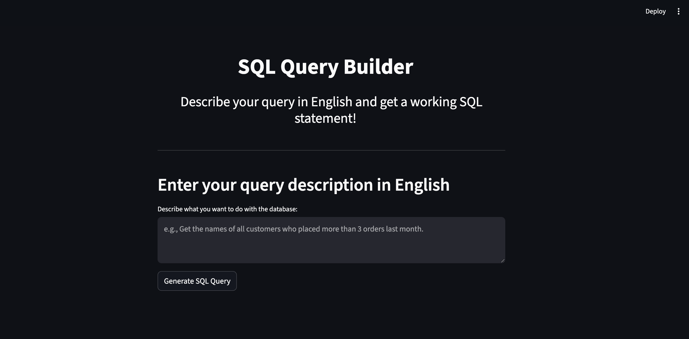
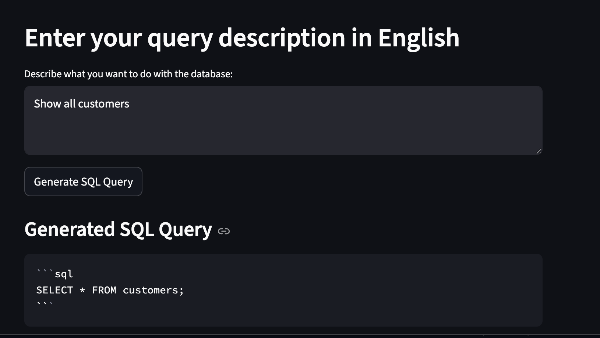
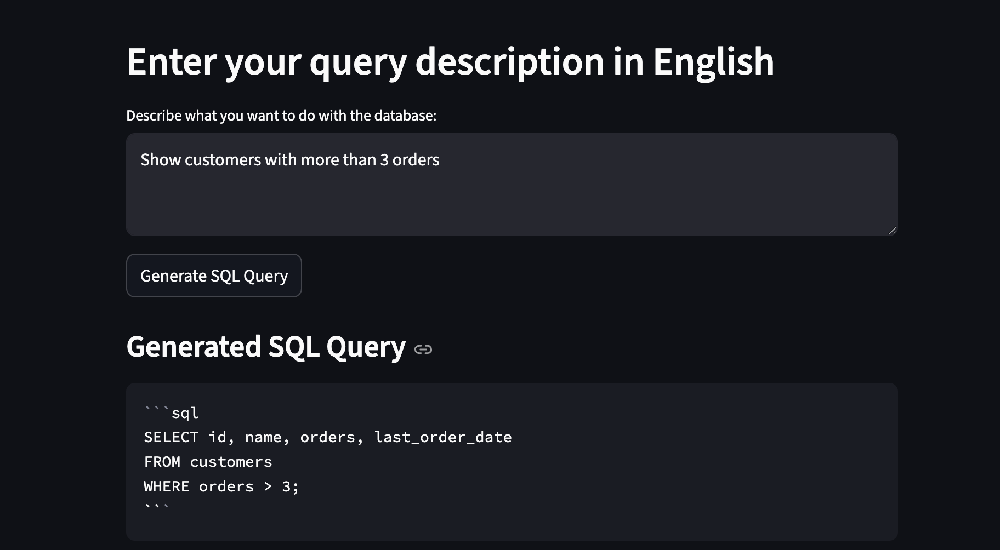

# AI-Powered SQL Query Builder

This is an **AI-powered SQL Query Builder** built with **Streamlit** and **Mistral AI API**.  

It converts natural language queries into SQL statements and executes them on a sample SQLite database, showing the results instantly.  

---

## Features

- Convert English text into SQL queries using Mistral AI  
- Execute SQL queries safely on a local SQLite database  
- Display query results in a table  
- Download results as CSV  
- Simple, interactive Streamlit web interface  

---

## Database Schema

**Table:** `customers`  

| Column           | Type    |
|-----------------|---------|
| id              | INTEGER PRIMARY KEY |
| name            | TEXT    |
| orders          | INTEGER |
| last_order_date | TEXT    |

Sample data is inserted automatically when running the app for the first time.

---

## How to Run

Clone the repo:

```bash
git clone https://github.com/aarushij978/sqlquerybuilder.git
cd sqlquerybuilder

Create a virtual environment (optional but recommended):

python3 -m venv venv
source venv/bin/activate

Install dependencies:

pip install -r requirements.txt

Set your Mistral API key (optional for AI part):

export MISTRAL_API_KEY="your_api_key_here"

or create a .env file with:

MISTRAL_API_KEY=your_api_key_here

Run the app:

streamlit run sqlbuilder.py

Open your browser at:

http://localhost:8501


Demo Screenshots

Place your screenshots in the demo_screenshots/ folder and update the filenames.

1. SQL Query Builder Main Page


2. Show all customers


3. Customers with more than 3 orders



Notes

Only SELECT queries are allowed for safety.

SQLite is used for simplicity — no external database installation required.

Your API key is optional; the app will still run with the sample DB.


Tech Stack

Python 3

Streamlit — Web app framework

SQLite — Local database

Pandas — For displaying query results

Mistral AI API — Convert natural language → SQL

Folder Structure (Recommended)
sqlquerybuilder/
├─ sqlbuilder.py
├─ requirements.txt
├─ README.md
├─ demo_screenshots/
│   ├─ placeholder_all_customers.png
│   └─ placeholder_customers_gt_3_orders.png
├─ .env (not committed)
└─ .gitignore

---

✅ Once you do all these changes:

1. Add `.env` locally with your key  
2. Add placeholders in `demo_screenshots/`  
3. Push to GitHub  

Your project will be **fully polished, secure, and ready to submit as a live working project**.

---